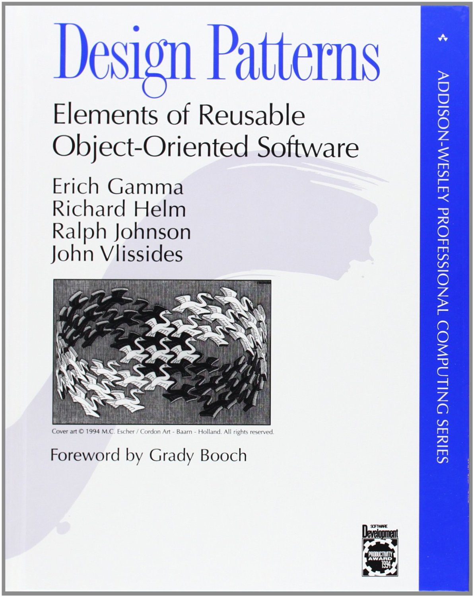
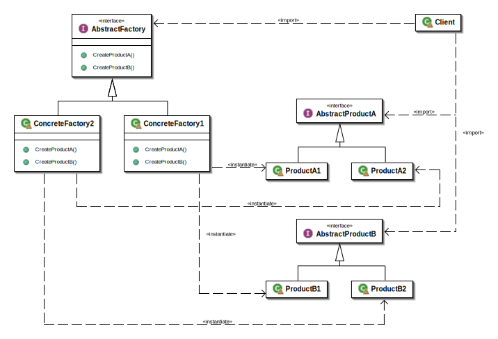
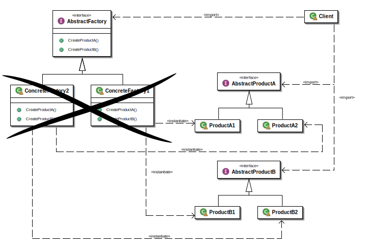

## Introduction
{: .notes}

<section markdown="1">
### Who are you?

This is me.
{: .notes}

    public final class λs {
        λ Identity = x -> x;

        λ True = x -> y -> x;
        λ False = x -> y -> y;

        λ Zero = f -> x -> x;
        λ Succ = n -> f -> x -> f.$(n.$(f).$(x));
        λ Pred = n -> f -> x ->
            n.$(g -> h -> h.$(g.$(f))).$(ignored -> x).$(u -> u);
        λ IsZero = f -> f.$(x -> False).$(True);

        λ Y = f ->
            λ(x -> f.$(x.$(x)))
                .$(x -> f.$(x.$(x)));
        λ Z = f ->
            λ(x -> f.$(y -> x.$(x).$(y)))
                .$(x -> f.$(y -> x.$(x).$(y)));

        ...
    }
{: .lots-of-code}

I do things like that for fun. You can see the full code as part of my [FizzBuzz project](https://github.com/SamirTalwar/FizzBuzz), inspired by Tom Stuart's talk, [Programming with Nothing](http://experthuman.com/programming-with-nothing).
{: .notes}
</section>

<section markdown="1">
### What do you want from me?

I want you to stop using design patterns.
</section>

<section markdown="1">
### Um…

OK, let me rephrase that.
{: .notes}

I want you to stop using design patterns like it's *1999*.
</section>

<section markdown="1">
## This is a book.

*Design Patterns* was a book written by the "Gang of Four" very nearly 20 years ago (at the time of writing this essay), which attempted to canonicalise and formalise the tools that many experienced software developers and designers found themselves using over and over again.

The originator of the concept (and the term "design pattern") was Christopher Alexander, who wasn't a software developer at all. Alexander was an architect who came up with the idea of rigorously documenting common problems in design with their potential solutions.

> The elements of this language are entities called patterns. Each pattern describes a problem that occurs over and over again in our environment, and then describes the core of the solution to that problem, in such a way that you can use this solution a million times over, without ever doing it the same way twice. <cite>— Christopher Alexander</cite>

Alexander, and the Gang of Four after him, did more than just document solutions to common problems in their respective universes. By naming these patterns and providing a good starting point, they hoped to provide a consistent *language*, as well as providing these tools up front so that even novices might benefit from them.
{: .notes}
</section>

<section class="slides-only" markdown="1">
## And now, an aside, on functional programming.

Functional programming is all about *functions*.
</section>

<section markdown="1">
## And now, an aside, on functional programming.

Functional programming is all about <em><del>functions</del> <ins>values</ins></em>.

Values like this:

    int courses = 3;

But also like this:

    Course dessert = prepareCake.using(eggs, butter, sugar, chocolate);

</section>

<section markdown="1">
And like this:

    Preparation prepareCake = new Preparation() {
        @Override
        public Course using(Ingredient eggs, Ingredient butter, Ingredient sugar, Ingredient special) {
            return new CakeMix(eggs, butter, sugar).with(special);
        }
    };

Which of course, is the same as this:

    Preparation prepareCake =
        (eggs, butter, sugar, special)
            -> new CakeMix(eggs, butter, sugar).with(special);

</section>

<section markdown="1">
But if we break apart that `using` method…

    interface MixPreparation {
        Mix using(Ingredient eggs, Ingredient butter, Ingredient sugar);
    }

    interface Mix {
        Course with(Ingredient special);
    }

We can do something like this:

    MixPreparation prepareCake =
        (eggs, butter, sugar)
            -> special
                -> new CakeMix(eggs, butter, sugar).with(special);

Which is the same as this:

    MixPreparation prepareCake =
        CakeMix::new;

</section>

<section markdown="1">
### Well.

Yes. It's weird, but it works out.

`CakeMix::new` is a *method reference* to `new CakeMix(…)`. Its type looks like this:

    (Ingredient, Ingredient, Ingredient) -> CakeMix

And `MixPreparation` looks like this:

    interface MixPreparation {
        Mix using(Ingredient eggs, Ingredient butter, Ingredient sugar);
    }

The function is coercible to the type of the *functional interface*, `MixPreparation`. Functionally, they're equivalent, and from version 1.8 and up, the JVM knows how to turn lambdas into anything matching the types with a *Single Abstract Method*.
{: .notes}
</section>

<section markdown="1">
## On to the Good Stuff
</section>

<section markdown="1">
### The Abstract Factory Pattern

This pattern is used *everywhere* in Java code, especially in more "enterprisey" code bases. It involves an interface and an implementation. The interface looks something like this:
{: .notes}

    public interface Bakery {
        Pastry bakePastry(Topping topping);
        Cake bakeCake();
    }
</section>

<section markdown="1">
And the implementation:
{: .notes}

    public class DanishBakery implements Bakery {
        @Override public Pastry bakePastry(Topping topping) {
            return new DanishPastry(Topping topping);
        }

        @Override public Cake bakeCake() {
            return new Aeblekage(); // mmmm, apple cake...
        }
    }
</section>

<section markdown="1">
More generally, the Abstract Factory pattern is usually implemented according to this structure.
{: .notes}

{: .image}

<cite markdown="1">[By Giacomo Ritucci, licensed under CC-BY-SA-3.0, via Wikimedia Commons](http://commons.wikimedia.org/wiki/File:Abstract_factory_UML.svg)</cite>

In this example, `Pastry` and `Cake` are "abstract products", and `Bakery` is an "abstract factory". Their implementations are the concrete variants.
{: .notes}
</section>

<section markdown="1">
Now, that's a fairly general example.
{: .notes}

In actual fact, most factories only have one "create" method.

    public interface Bakery {
        Pastry bakePastry(Topping topping);
    }

And often comply with a very generic interface:

    package java.util.function;

    @FunctionalInterface
    public interface Function<T, R> {
        /**
         * Applies this function to the given argument.
         */
        R apply(T t);

        ...
    }

Hmmm…

    public interface Bakery extends Function<Topping, Pastry> {
        // this isn't necessary
        @Override
        Pastry apply(Topping topping);
    }

Oh look, it's a function.

This denegerate case is pretty common in in the Abstract Factory pattern, as well as many others. While most of them provide for lots of discrete pieces of functionality, and so have lots of methods, we often tend to break them up into single-method types, either for flexibility or because we just don't need more than one thing at a time.
{: .notes}

</section>

<section markdown="1">
So how would we implement this pastry maker?

    public class DanishBakery implements Bakery {
        @Override public Pastry apply(Topping topping) {
            return new DanishPastry(Topping topping);
        }
    }

OK, sure, that was easy. It looks the same as the earlier `DanishBakery` except it can't make cake. Delicious apple cake… what's the point of that?

Well, if you remember, `Bakery` is now simply a subtype of `Function` which adds no further behaviour, which means it has a **Single Abstract Method**. This means it's a **Functional Interface**.

So what's the functional equivalent to this?

    Bakery danishBakery = topping -> new DanishPastry(topping);

Or even:

    Bakery danishBakery = DanishPastry::new;

Voila. Our `DanishBakery` class has gone.

We could even get rid of the `Bakery` interface here and just use `Function<Topping, Pastry>` instead. In this case, we might want to keep it, as it has a name relevant to our business, but often, `Factory`-like objects serve no real domain purpose except to help us decouple our code. (`ServiceFactory`, anyone?) This is brilliant, but on these occasions, we don't need explicit classes for it—Java 8 has a bunch of interfaces built in that suit our needs fairly well.
{: .notes}

</section>

<section markdown="1">
Here's our updated UML diagram:

{: .image}

Aaaaaah. Much better.
</section>

<section markdown="1">
### An aside: Bad Design Patterns

Not all design patterns in the Gang of Four's book are treated equally by contemporary programmers. A number of them are seen as examples of bad design.
{: .notes}

Here's my favourite:

    public class DumpingGround {
        private static DumpingGround instance = null;

        private DumpingGround() { }

        public static synchronized DumpingGround getInstance() {
            if (instance == null) {
                instance = new DumpingGround();
            }
            return instance;
        }
    }

Ew.

There's so much wrong with that code. This is an example of the *singleton pattern*, which is an idiom for sharing an object throughout your codebase with minimum effort. Assuming you want to write code that is unmaintainable. Singleton objects are pervasive—they get everywhere—and so your design becomes incredibly coupled to this one object. That means that replacing it, changing it or reworking it is practically impossible. It also makes it very hard to test your code, as the singleton has state, and so anything that uses it becomes completely interdependent with everything else.
{: .notes}

There are more bad design patterns, which I will not dwell upon further. I simply bring this one up to demonstrate that not all are worth rescuing. Now, let's take a look at one I quite like instead.
{: .notes}
</section>

<section markdown="1">
### The Adapter Pattern

The Adapter pattern bridges worlds. In one world, we have an interface for a concept; in another world, we have a different interface. These two interfaces serve different purposes, but sometimes we need to transfer things across. In a well-written universe, we can use *adapters* to make objects following one protocol adhere to the other.
{: .notes}

There are two kinds of Adapter pattern. We're not going to talk about this one:

    interface Fire {
        <T> Burnt<T> burn(T thing);
    }

    interface Oven {
        Food cook(Food food);
    }

    class WoodFire implements Fire { ... }

    class MakeshiftOven extends WoodFire implements Oven {
        @Override public Food cook(Food food) {
            Burnt<Food> noms = burn(food);
            return noms.scrapeOffBurntBits();
        }
    }

This form, the *class Adapter pattern*, freaks me out, because `extends` gives me the heebie jeebies. *Why* is out of the scope of this essay; feel free to ask me any time and I'll gladly talk your ears (and probably your nose) off about it.
{: .notes}
</section>

<section markdown="1">
Instead, let's talk about the *object Adapter pattern*, which is generally considered far more useful and flexible in all regards.

Let's take a look at the same class, following this alternative:

    class MakeshiftOven implements Oven {
        private final Fire fire;

        public MakeshiftOven(Fire fire) {
            this.fire = fire;
        }

        @Override public Food cook(Food food) {
            Burnt<Food> noms = fire.burn(food);
            return noms.scrapeOffBurntBits();
        }
    }

And we'd use it like this:

    Oven oven = new MakeshiftOven(fire);
    Food bakedPie = oven.cook(pie);

</section>

<section markdown="1">
The pattern generally follows this simple structure:

**INSERT UML HERE**

That's nice, right?
</section>

<section markdown="1">
Yes. Sort of. We can do better.

We already have a reference to a `Fire`, so constructing another object just to play with it seems a bit… overkill. And that object implements `Oven`. Which has a *single abstract method*. I'm seeing a trend here.

Instead, we can make a function that does the same thing.

    Oven oven = food -> fire.burn(food).scrapeOffBurntBits();
    Food bakedPie = oven.cook(pie);

We could go one further and compose method references, but it actually gets worse.
{: .notes}

    // Do *not* do this.
    Function<Food, Burnt<Food>> burn = fire::burn;
    Function<Food, Food> cook = burn.andThen(Burnt::scrapeOffBurntBits);
    Oven oven = cook::apply;
    Food bakedPie = oven.cook(pie);

This is because Java can't convert between functional interfaces implicitly, so we need to give it lots of hints about what each phase of the operation is. Lambdas, on the other hand, are implicitly coercible to any functional interface with the right types, and the compiler does a pretty good job of figuring out how to do it.
{: .notes}

</section>

<section markdown="1">
Often, though, all we really need is a method reference.

    Future<Sandwich> sandwichFuture
        = sudo.makeMeA(Sandwich.class);

    Supplier<Sandwich> sandwichSupplier
        = () -> sandwichFuture.get();

    Supplier<Sandwich> sandwichSupplier
        = sandwichFuture::get;

</section>

<section markdown="1">
Our new UML diagram will look something like this:
{: .notes}

**INSERT UML HERE**

Java 8 has made adapters so much simpler that I hesitate to call them a pattern any more. The concept is still very important; by explicitly creating adapters, we can keep these two worlds separate except at defined boundary points. The implementations, though? They're just functions.
{:.notes}
</section>

<section markdown="1">
### The Chain of Responsibility pattern

Here's a thing you might not see a lot.

    @Test public void whoAteMyPie() {
        PieEater alice = PieEater.withFavourite(APPLE);
        PieEater bob = PieEater.withFavourite(BLACKBERRY);
        PieEater carol = PieEater.withFavourite(CARROT);

        alice.setNext(bob);
        bob.setNext(carol);

        assertThat(alice.whoAte(BLACKBERRY), is(bob));
    }

It might look odd, but the idea is fairly common.
</section>

<section markdown="1">
For example, a Java logging framework might construct a chain of loggers:

    private static Logger createChain() {
        Logger stdoutLogger = new StdoutLogger(LogLevel.DEBUG);

        Logger emailLogger = new EmailLogger(LogLevel.NOTICE);
        stdoutLogger.setNext(emailLogger);

        Logger stderrLogger = new StderrLogger(LogLevel.ERR);
        emailLogger.setNext(stderrLogger);

        return stdoutLogger;
    }
</section>

<section markdown="1">
Or a website might use a chain of handlers to handle an HTTP request:

    private static Handler createHandler() {
        Handler homePageHandler
            = new PageHandler("/", request -> serveHomePage(request));
        Handler aboutPageHandler
            = new PageHandler("/about", request -> serveAboutPage(request));
        Handler staticAssetsHandler
            = new StaticResourceHandler("/assets", Paths.get("/assets"));
        Handler notFoundHandler = new NotFoundHandler();

        homePageHandler.setNext(aboutPageHandler);
        aboutPageHandler.setNext(staticAssetsHandler);
        staticAssetsHandler.setNext(notFoundHandler);

        return homePageHandler;
    }
</section>

<section markdown="1">
In UML, it looks a little like this:
{: .notes}

**INSERT UML HERE**
</section>

<section markdown="1">
#### This is probably bad practice.

The Chain of Responsibility pattern is generally considered an *anti-pattern* now, for many reasons.

<ul>
  <li class="fragment">First of all, there's the copious amount of mutation,</li>
  <li class="fragment">then there's the confusion… is it one thing or everything?</li>
  <li class="fragment">Not to mention, the order of operations is incredibly easy to get wrong,</li>
  <li class="fragment">and finally, you have no idea whether anything useful will happen at all, as you can fall right off the end of the chain.</li>
</ul>
{: .notes}

Let's dive a little further into how we can salvage something from all of this.
{: .notes}
</section>

<section markdown="1">
Remember our pie eaters?

    @Test public void whoAteMyPie() {
        PieEater alice = PieEater.withFavourite(APPLE);
        PieEater bob = PieEater.withFavourite(BLACKBERRY);
        PieEater carol = PieEater.withFavourite(CARROT);

        alice.setNext(bob);
        bob.setNext(carol);

        assertThat(alice.whoAte(BLACKBERRY), is(bob));
    }

That assertion is using [Hamcrest matchers](https://code.google.com/p/hamcrest/wiki/Tutorial#Sugar), by the way. Check them out if you're not too familiar with them. They're amazing.
{: .notes}
</section>

<section markdown="1">
#### Step 1: Stop mutating.

Instead of setting the next person later, we'll construct each person with the next.
{: .notes}

    @Test public void whoAteMyPie() {
        PieEater carol = PieEater.atTheEnd()
            .withFavourite(CARROT);
        PieEater bob = PieEater.before(carol)
            .withFavourite(BLACKBERRY);
        PieEater alice = PieEater.before(bob)
            .withFavourite(APPLE);

        assertThat(alice.whoAte(BLACKBERRY), is(bob));
    }

This hasn't changed much, unfortunately. It's still very confusing why Alice would know the answer to the question, and we could still get things in the wrong order or ask the wrong person. Asking Carol would probably lead a complete dead end.
{: .notes}
</section>

<section markdown="1">
#### Step 2: Separate behaviours.

`PieEater` does two things: delegate to the next person and identify pie. Let's split that up into two different concepts. We'll have a type, `Chain`, which handles what's next.
{: .notes}

    @Test public void whoAteMyPie() {
        Chain<PieEater> carol
            = Chain.endingWith(PieEater.withFavourite(CARROT));
        Chain<PieEater> bob
            = Chain.from(PieEater.withFavourite(BLACKBERRY)).to(carol);
        Chain<PieEater> alice
            = Chain.from(PieEater.withFavourite(APPLE)).to(bob);

        assertThat(alice.find(pieEater -> pieEater.ate(BLACKBERRY)),
                   is(bob));
    }

Note that `Chain` is generic by nature, and so doesn't  know anything about the object, `PieEater`. This means that when we ask it a question, we have to give it more information on its contents so it can do its job. We do this by providing a lambda to the `find` method which tells it *how* to find the culprit. In essence, instead of the behaviour being *baked in* (pun totally intended) to the `PieEater` or `Chain` types, we extract it out.

We now have three distinct concepts here:

  * The pie eater, who eats pies,
  * the `Chain`, which is a piece of infrastructure that lets us find things, and
  * the operation passed to `find`, described in terms of the `ate` method.

</section>

<section markdown="1">
#### Step 3: Split the domain from the infrastructure.

The `Chain` type is now pretty generic, and so can be detached entirely from our domain objects. Let's keep it away from our pie eaters.
{: .notes}

    @Test public void whoAteAllThePies() {
        PieEater alice = PieEater.withFavourite(APPLE);
        PieEater bob = PieEater.withFavourite(BLACKBERRY);
        PieEater carol = PieEater.withFavourite(CARROT);

        Chain<PieEater> pieEaters
            = Chain.from(alice).to(Chain.from(bob).to(Chain.endingWith(carol)));

        assertThat(pieEaters.find(pieEater -> pieEater.ate(BLACKBERRY)),
                   is(bob));
    }

OK, they're back in order now. Whew. That was starting to upset me.
{: .notes}
</section>

<section markdown="1">
#### Step 4: Identify reusable infrastructure.

That `Chain` type looks awfully familiar at this point.

Perhaps it looks something like this:

    cons(alice, cons(bob, cons(carol, nil)))

Oh, look, [we're coding Lisp](http://en.wikipedia.org/wiki/Cons).

Specifically, we're using a construct very similar to Lisp's immutable linked list data structure. Which makes me wonder: can we use our own lists here, or something similar?
{:.notes}

    @Test public void whoAteAllThePies() {
        PieEater alice = PieEater.withFavourite(APPLE);
        PieEater bob = PieEater.withFavourite(BLACKBERRY);
        PieEater carol = PieEater.withFavourite(CARROT);

        Stream<PieEater> pieEaters = Stream.of(alice, bob, carol);

        Optional<PieEater> greedyOne
            = pieEaters.findAny(pieEater -> pieEater.ate(BLACKBERRY));
        assert greedyOne.get() == bob;
    }

A [`Stream`](http://docs.oracle.com/javase/8/docs/api/java/util/stream/Stream.html), in Java 8, is a single-use sequence of elements supporting aggregate operations. In this case, we're only using one of its operations, `findAny`, but it has many more capabilities. It's *not* a list, but in our case, we can construct it from a list and then use it to discover information about it.
{: .notes}

</section>

<section markdown="1">
Our new structure is quite different—far more so than the earlier examples.
{: .notes}

**INSERT UML HERE**

By decoupling the business domain (in this case, pie eating) from the infrastructure (traversing a list of elements), we're able to come up with much cleaner code. This was only possible because we were able to tell the infrastructure something about our domain—i.e. how to detect who ate all the pies—by passing behaviour around in the form of a lambda expression.
{: .notes}
</section>

<section markdown="1">
## So… what's your point?

We've seen three examples of design patterns that can be drastically improved by approaching them with a functional mindset. Together, these three span the spectrum.

  * The Abstract Factory pattern is an example of a **creational** pattern, which increases flexibility during the application wiring process
  * The Adapter pattern, a **structural** pattern, is a huge aid in object composition
  * The Chain of Responsibility pattern is a good demonstration of a **behavioural** *anti-pattern* that actually makes the communication between objects *more* rigid

We took these three patterns, made them a lot smaller, removed a lot of boilerplate, and knocked out a bunch of extra classes we didn't need in the process.

In all cases, we split things apart, only defining the coupling between them in the way objects were constructed. But more than that: we made them functional. The difference between domain objects and infrastructural code became much more explicit. This allowed us to generalise, using the built-in interfaces to do most of the heavy lifting for us, allowing us to eradicate lots of infrastructural types and concentrate on our domain.

It's funny, all this talk about our business domain. It's almost as if the resulting code became a lot more object-oriented too.

</section>

<section class="slides-only" markdown="1">
## Thank you.
</section>
