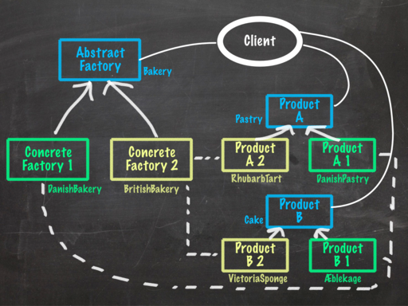
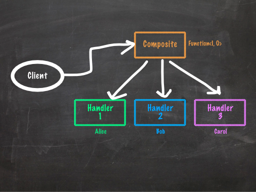

## Introduction

### Who are you?

This is me.

    public final class λs {
        λ Identity = x -> x;

        λ True = x -> y -> x;
        λ False = x -> y -> y;

        λ Zero = f -> x -> x;
        λ Succ = n -> f -> x -> f.$(n.$(f).$(x));
        λ Pred = n -> f -> x ->
            n.$(g -> h -> h.$(g.$(f))).$(ignored -> x).$(u -> u);
        λ IsZero = f -> f.$(x -> False).$(True);

        λ Y = f ->
            λ(x -> f.$(x.$(x)))
                .$(x -> f.$(x.$(x)));
        λ Z = f ->
            λ(x -> f.$(y -> x.$(x).$(y)))
                .$(x -> f.$(y -> x.$(x).$(y)));

        ...
    }

I do things like that for fun. You can see the full code as part of my [FizzBuzz project](https://github.com/SamirTalwar/FizzBuzz), inspired by Tom Stuart's talk, [Programming with Nothing](http://experthuman.com/programming-with-nothing).

### What do you want from me?

I want you to stop using design patterns.

### Um…

OK, let me rephrase that.

I want you to stop using design patterns like it's *1999*.

## This is a book.

*Design Patterns* was a book by the "Gang of Four", first published very nearly 20 years ago (at the time of writing this essay), which attempted to canonicalise and formalise the tools that many experienced software developers and designers found themselves using over and over again.

The originator of the concept (and the term "design pattern") was Christopher Alexander, who wasn't a software developer at all. Alexander was an architect who came up with the idea of rigorously documenting common problems in design with their potential solutions.

> The elements of this language are entities called patterns. Each pattern describes a problem that occurs over and over again in our environment, and then describes the core of the solution to that problem, in such a way that you can use this solution a million times over, without ever doing it the same way twice. <cite>— Christopher Alexander</cite>

Alexander, and the Gang of Four after him, did more than just document solutions to common problems in their respective universes. By naming these patterns and providing a good starting point, they hoped to provide a consistent *language*, as well as providing these tools up front so that even novices might benefit from them.

## And now, an aside, on functional programming.

Functional programming is all about <em><del>functions</del> <ins>values</ins></em>.

Values like this:

    int courses = 3;

But also like this:

    Course dessert = prepareCake.madeOf(chocolate);

And like this:

    Preparation prepareCake = new Preparation() {
        @Override
        public Course madeOf(Ingredient deliciousIngredient) {
            return new CakeMix(eggs, butter, sugar)
                    .combinedWith(deliciousIngredient);
        }
    };

Preparation looks like this:

    interface Preparation {
        Course madeOf(Ingredient deliciousIngredient);
    }

So of course, the `prepareCake` object could also be written like this.

    Preparation prepareCake =
        deliciousIngredient ->
            new CakeMix(eggs, butter, sugar)
                .combinedWith(deliciousIngredient);

Because `Preparation` is an interface with a **Single Abstract Method**, any lambda with the same type signature as `Preparation`'s method signature can be assigned to an object of type `Preparation`. This means that `Preparation` is a **functional interface**.

We can go one further. The above code is almost the same as this:

    Mix cakeMix = new CakeMix(eggs, butter, sugar);
    Preparation prepareCake = cakeMix::combinedWith;

(Assuming `cakeMix` is an immutable value object. This code only constructs a single `CakeMix`; the code above it constructs a new one each time.)

### Well.

Yes. It's weird, but it works out.

We're assigning `prepareCake` a reference to the `combinedWith` method of `cakeMix`:

    cakeMix::combinedWith

`cakeMix::combinedWith` is a *method reference*. Its type looks like this:

    Course combinedWith(Ingredient);

And it's (pretty much) exactly the same as `ingredient -> cakeMix.combinedWith(ingredient)`.

## On to the Good Stuff

### The Abstract Factory Pattern

This pattern is used *everywhere* in Java code, especially in more "enterprisey" code bases. It involves an interface and an implementation. The interface looks something like this:

    public interface Bakery {
        Pastry bakePastry(Topping topping);
        Cake bakeCake();
    }

And the implementation:

    public class DanishBakery implements Bakery {
        @Override public Pastry bakePastry(Topping topping) {
            return new DanishPastry(topping);
        }

        @Override public Cake bakeCake() {
            return new Aeblekage(); // mmmm, apple cake...
        }
    }

More generally, the Abstract Factory pattern is usually implemented according to this structure.

{: .image}

In this example, `Pastry` and `Cake` are "abstract products", and `Bakery` is an "abstract factory". Their implementations are the concrete variants.

Now, that's a fairly general example.

In actual fact, most factories only have one "create" method.

    @FunctionalInterface
    public interface Bakery {
        Pastry bakePastry(Topping topping);
    }

Oh look, it's a function.

This denegerate case is pretty common in in the Abstract Factory pattern, as well as many others. While most of them provide for lots of discrete pieces of functionality, and so have lots of methods, we often tend to break them up into single-method types, either for flexibility or because we just don't need more than one thing at a time.

So how would we implement this pastry maker?

    public class DanishBakery implements Bakery {
        @Override public Pastry apply(Topping topping) {
            return new DanishPastry(Topping topping);
        }
    }

OK, sure, that was easy. It looks the same as the earlier `DanishBakery` except it can't make cake. Delicious apple cake… what's the point of that?

Well, if you remember, `Bakery` has a **Single Abstract Method**. This means it's a **Functional Interface**.

So what's the functional equivalent to this?

    Bakery danishBakery = topping -> new DanishPastry(topping);

Or even:

    Bakery danishBakery = DanishPastry::new;

Voila. Our `DanishBakery` class has gone.

But we can go further.

    package java.util.function;
    /**
     * Represents a function that
     * accepts one argument and produces a result.
     *
     * @since 1.8
     */
    @FunctionalInterface
    public interface Function<T, R> {
        /**
         * Applies this function to the given argument.
         */
        R apply(T t);

        ...
    }

We can replace the `Bakery` with `Function<Topping, Pastry>`; they have the same types.

    Function<Topping, Pastry> danishBakery = DanishPastry::new;

In this case, we might want to keep it, as it has a name relevant to our business, but often, `Factory`-like objects serve no real domain purpose except to help us decouple our code. (`UserServiceFactory`, anyone?) This is brilliant, but on these occasions, we don't need explicit classes for it—Java 8 has a bunch of interfaces built in, such as `Function`, `Supplier` and many more in the `java.util.function` package, that suit our needs fairly well.

Here's our updated UML diagram:

{: .image}

Aaaaaah. Much better.

### The Adapter Pattern

The Adapter pattern bridges worlds. In one world, we have an interface for a concept; in another world, we have a different interface. These two interfaces serve different purposes, but sometimes we need to transfer things across. In a well-written universe, we can use *adapters* to make objects following one protocol adhere to the other.

There are two kinds of Adapter pattern. We're not going to talk about this one:

    interface Fire {
        <T> Burnt<T> burn(T thing);
    }

    interface Oven {
        Food cook(Food food);
    }

    class WoodFire implements Fire { ... }

    class MakeshiftOven extends WoodFire implements Oven {
        @Override public Food cook(Food food) {
            Burnt<Food> noms = burn(food);
            return noms.scrapeOffBurntBits();
        }
    }

This form, the *class Adapter pattern*, freaks me out, because `extends` gives me the heebie jeebies. *Why* is out of the scope of this essay; feel free to ask me any time and I'll gladly talk your ears (and probably your nose) off about it.

Instead, let's talk about the *object Adapter pattern*, which is generally considered far more useful and flexible in all regards.

Let's take a look at the same class, following this alternative:

    class MakeshiftOven implements Oven {
        private final Fire fire;

        public MakeshiftOven(Fire fire) {
            this.fire = fire;
        }

        @Override public Food cook(Food food) {
            Burnt<Food> noms = fire.burn(food);
            return noms.scrapeOffBurntBits();
        }
    }

And we'd use it like this:

    Oven oven = new MakeshiftOven(fire);
    Food bakedPie = oven.cook(pie);

The pattern generally follows this simple structure:

{: .image}

That's nice, right?

Yes. Sort of. We can do better.

We already have a reference to a `Fire`, so constructing another object just to play with it seems a bit… overkill. And that object implements `Oven`. Which has a *single abstract method*. I'm seeing a trend here.

Instead, we can make a function that does the same thing.

    Oven oven = food -> fire.burn(food).scrapeOffBurntBits();
    Food bakedPie = oven.cook(pie);

We could go one further and compose method references, but it actually gets worse.

    // Do *not* do this.
    Function<Food, Burnt<Food>> burn = fire::burn;
    Function<Food, Food> cook = burn.andThen(Burnt::scrapeOffBurntBits);
    Oven oven = cook::apply;
    Food bakedPie = oven.cook(pie);

This is because Java can't convert between functional interfaces implicitly, so we need to give it lots of hints about what each phase of the operation is. Lambdas, on the other hand, are implicitly coercible to any functional interface with the right types, and the compiler does a pretty good job of figuring out how to do it.

Our new UML diagram will look something like this:

{: .image}

Often, though, all we really need is a method reference. For example, take the `Executor` interface.

    package java.util.concurrent;

    /**
     * An object that executes submitted {@link Runnable} tasks.
     */
    public interface Executor {
        void execute(Runnable command);
    }

It consumes `Runnable` objects, and it's a very useful interface.

Now let's say we have one of those, and a bunch of `Runnable` tasks, held in a `Stream`.

    Executor executor = ...;
    Stream<Runnable> tasks = ...;

How do we execute all of them on our `Executor`?

This won't work:

    tasks.forEach(executor);

It turns out the `forEach` method on `Stream` *does* take a consumer, but a very specific type:

    public interface Stream<T> {
        ...

        void forEach(Consumer<? super T> action);

        ...
    }

A `Consumer` looks like this:

    @FunctionalInterface
    public interface Consumer<T>
    {
        void accept(T t);

        ...
    }

At first glance, that doesn't look so helpful. But note that `Consumer` is a functional interface, so we can use lambdas to specify them really easily. That means that we can do this:

    tasks.forEach(task -> executor.execute(task));

Which can be simplified further to this:

    tasks.forEach(executor::execute);

Java 8 has made adapters so much simpler that I hesitate to call them a pattern any more. The concept is still very important; by explicitly creating adapters, we can keep these two worlds separate except at defined boundary points. The implementations, though? They're just functions.
{:.notes}

### The Chain of Responsibility pattern

Here's a thing you might not see a lot.

    @Test public void whoAteMyPie() {
        PieEater alice = PieEater.withFavourite(APPLE);
        PieEater bob = PieEater.withFavourite(BLUEBERRY);
        PieEater carol = PieEater.withFavourite(CHERRY);

        alice.setNext(bob);
        bob.setNext(carol);

        alice.give(blueberryPie);

        assertThat(bob, ate(blueberryPie));
    }

It might look odd, but the idea is fairly common. For example, the Java Servlets framework uses the concept of a `FilterChain` to model a sequence of filters upon a request.

You can use `Filter` objects to do pretty much anything with a request. Here's one that tracks how many hits there have been to a site. Notice that it passes the `request` and `response` objects onto the next filter in the chain when it's done.

    public final class HitCounterFilter implements Filter {
        // initialization and destruction methods go here

        public void doFilter(
                ServletRequest request,
                ServletResponse response,
                FilterChain chain)
        {
            int hits = getCounter().incCounter();
            log(“The number of hits is ” + hits);
            chain.doFilter(request, response);
        }
    }

We might use an object in the chain to modify the input or output (in this case, the request or response):

    public final class SwitchEncodingFilter implements Filter {
        // initialization and destruction methods go here

        public void doFilter(
                ServletRequest request,
                ServletResponse response,
                FilterChain chain)
        {
            request.setEncoding(“UTF-8”);
            chain.doFilter(request, response);
        }
    }

We might even bail out of the chain early if things are going pear-shaped.

    public final class AuthorizationFilter implements Filter {
        // initialization and destruction methods go here

        public void doFilter(
                ServletRequest request,
                ServletResponse response,
                FilterChain chain)
        {
            if (!user().canAccess(request)) {
                throw new AuthException(user);
            }
            chain.doFilter(request, response);
        }
    }

Basically, once you hit an element in the chain, it has full control.

In UML, it looks a little like this:

{: .image}

#### This is probably bad practice.

The Chain of Responsibility pattern is generally considered an *anti-pattern* now, for many reasons.

  * First of all, there's the copious amount of mutation.
  * Then there's the confusion… is it one thing or everything?
  * Not to mention, the order of operations is incredibly easy to get wrong.
  * Finally, you have no idea whether anything useful will happen at all, as you can fall right off the end of the chain.

Let's dive a little further into how we can salvage something from all of this.

Remember our pie eaters?

    @Test public void whoAteMyPie() {
        PieEater alice = PieEater.withFavourite(APPLE);
        PieEater bob = PieEater.withFavourite(BLUEBERRY);
        PieEater carol = PieEater.withFavourite(CHERRY);

        alice.setNext(bob);
        bob.setNext(carol);

        alice.give(blueberryPie);

        assertThat(bob, ate(blueberryPie));
    }

That assertion is using [Hamcrest matchers](https://code.google.com/p/hamcrest/wiki/Tutorial#Sugar), by the way. Check them out if you're not too familiar with them. They're amazing.

#### Step 1: Stop mutating.

Instead of setting the next person later, we'll construct each person with the next.

    @Test public void whoAteMyPie() {
        PieEater carol = PieEater.atTheEnd()
            .withFavourite(CHERRY);
        PieEater bob = PieEater.before(carol)
            .withFavourite(BLUEBERRY);
        PieEater alice = PieEater.before(bob)
            .withFavourite(APPLE);

        alice.give(blueberryPie);

        assertThat(bob, ate(blueberryPie));
    }

This hasn't changed much, unfortunately. It's still very confusing why we give the pie to Alice, not anyone else, and we could still get things in the wrong order or ask the wrong person. Giving it Carol would lead to a complete dead end.

#### Step 2: Separate behaviours.

`PieEater` does two things: delegate to the next person and identify pie. Let's split that up into two different concepts. We'll have a type, `Chain`, which handles what's next.

    @Test public void whoAteMyPie() {
        Chain<PieEater> carol
            = Chain.endingWith(PieEater.withFavourite(CHERRY));
        Chain<PieEater> bob
            = Chain.from(PieEater.withFavourite(BLUEBERRY))
                   .to(carol);
        Chain<PieEater> alice
            = Chain.from(PieEater.withFavourite(APPLE))
                   .to(bob);

        alice.give(blueberryPie);

        assertThat(bob, ate(blueberryPie));
    }

We now have two distinct concepts:

  * The pie eater, who eats pies, and
  * the `Chain`, which gives pies to pie eaters.

#### Step 3: Split the domain from the infrastructure.

The `Chain` type still knows too much about pie eating. I want something generic that can be detached entirely from our domain objects. Let's keep it away from our pie eaters.

    @Test public void whoAteMyPie() {
        PieEater alice = PieEater.withFavourite(APPLE);
        PieEater bob = PieEater.withFavourite(BLUEBERRY);
        PieEater carol = PieEater.withFavourite(CHERRY);

        Chain<PieEater> pieEaters
            = Chain.from(alice).to(Chain.from(bob).to(Chain.endingWith(carol)));

        pieEaters.find(person -> person.loves(BLUEBERRY))
                 .give(blueberryPie);

        assertThat(bob, ate(blueberryPie));
    }

Note that this version of the `Chain` is generic by nature, and so doesn't know anything about the object, `PieEater`. This means that when we do things with it, we have to give it more information on its contents so it can do its job. We do this by providing a lambda to the `find` method which tells it *how* to find the culprit. In essence, instead of the behaviour being *baked in* (pun totally intended) to the `PieEater` or `Chain` types, we extract it out.

We now have three distinct concepts:
  * The pie eater, who eats pies, and
  * the `Chain`, which is a piece of infrastructure that lets us find things, and
  * the operation passed to `find`, described in terms of the `loves` method.

Oh, and the pie eaters are back in order now. Whew. That was starting to upset me.

#### Step 4: Identify reusable infrastructure.

That `Chain` type looks awfully familiar at this point.

Perhaps it looks something like this:

    (cons alice (cons bob (cons carol nil)))

Oh, look, [we're writing Lisp](http://en.wikipedia.org/wiki/Cons).

Specifically, we're using a construct very similar to Lisp's immutable linked list data structure. Which makes me wonder: can we use our own lists here, or something similar?

    @Test public void whoAteMyPie() {
        PieEater alice = PieEater.withFavourite(APPLE);
        PieEater bob = PieEater.withFavourite(BLUEBERRY);
        PieEater carol = PieEater.withFavourite(CHERRY);

        Stream<PieEater> pieEaters = Stream.of(alice, bob, carol);

        Optional<PieEater> greedyOne
            = pieEaters.findAny(pieEater -> pieEater.ate(BLACKBERRY));
        assert greedyOne.get() == bob;
    }

A [`Stream`](http://docs.oracle.com/javase/8/docs/api/java/util/stream/Stream.html), in Java 8, is a single-use sequence of elements supporting aggregate operations. In this case, we're only using one of its operations, `findAny`, but it has many more capabilities. It's *not* a list, but in our case, we can construct it from a list and then use it to discover information about it.

Our new structure is quite different—far more so than the earlier examples.

{: .image}

By decoupling the business domain (in this case, pie eating) from the infrastructure (traversing a list of elements), we're able to come up with much cleaner code. This was only possible because we were able to tell the infrastructure something about our domain—i.e. how to detect who ate all the pies—by passing behaviour around in the form of a lambda expression.

## So… what's your point?

We've seen three examples of design patterns that can be drastically improved by approaching them with a functional mindset. Together, these three span the spectrum.

  * The Abstract Factory pattern is an example of a **creational** pattern, which increases flexibility during the application wiring process
  * The Adapter pattern, a **structural** pattern, is a huge aid in object composition
  * The Chain of Responsibility pattern is a good demonstration of a **behavioural** *anti-pattern* that actually makes the communication between objects *more* rigid

We took these three patterns, made them a lot smaller, removed a lot of boilerplate, and knocked out a bunch of extra classes we didn't need in the process.

In all cases, we split things apart, only defining the coupling between them in the way objects were constructed. But more than that: we made them functional. The difference between domain objects and infrastructural code became much more explicit. This allowed us to generalise, using the built-in interfaces to do most of the heavy lifting for us, allowing us to eradicate lots of infrastructural types and concentrate on our domain.

It's funny, all this talk about our business domain. It's almost as if the resulting code became a lot more object-oriented too.
